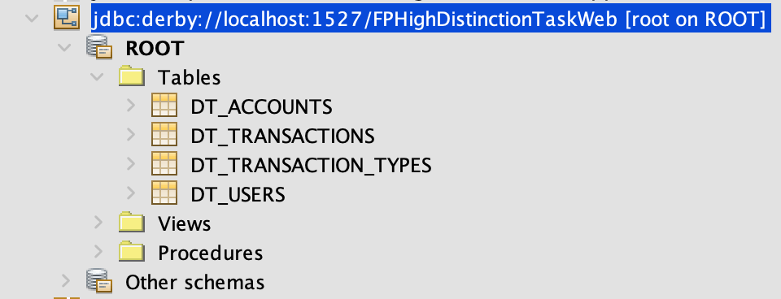
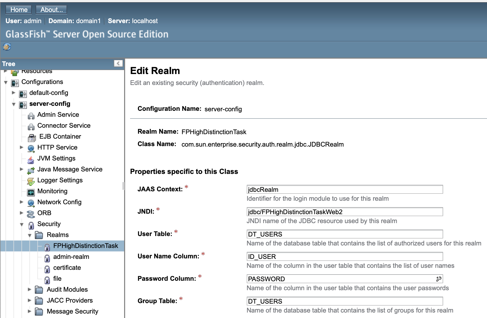
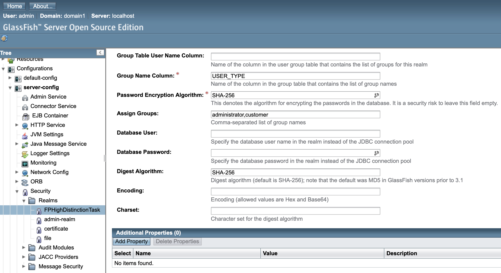

# Transaction Management Java EE Application

This Java EE application allows users to create and manage transactions. The application is built using Java EE technologies and is designed to be deployed on a GlassFish server. This README file provides an overview of the application, instructions for setup, and steps to get the application running.

## Table of Contents

- [Features](#features)
- [Requirements](#requirements)
- [Setup Instructions](#setup-instructions)
  - [GlassFish Server](#glassfish-server)
  - [Derby Database](#derby-database)
  - [GlassFish Realm Configuration](#glassfish-realm-configuration)
- [Deployment](#deployment)
- [Usage](#usage)
- [Contributing](#contributing)
- [License](#license)

## Features

- Create, update, and delete transactions.
- View transaction details.
- User authentication and authorization.
- Persistence using Derby database.

## Requirements

- Java Development Kit (JDK) 8 or higher
- GlassFish Server 5.0 or higher
- Apache Derby database
- Netbeans 8.2

## Setup Instructions

### GlassFish Server

1. **Download and Install GlassFish Server:**
   - Download GlassFish Server from the official website: [GlassFish Downloads](https://javaee.github.io/glassfish/download)
   - Follow the installation instructions provided on the website.

2. **Start GlassFish Server:**
   - Navigate to the GlassFish installation directory.
   - Run the following command to start the server:
     ```bash
     bin/asadmin start-domain
     ```

### Derby Database

1. **Download and Install Apache Derby:**
   - Download Apache Derby from the official website: [Apache Derby Downloads](https://db.apache.org/derby/derby_downloads.html)
   - Follow the installation instructions provided on the website.

2. **Set Up Derby Database:**
   - Start the Derby network server by running:
     ```bash
     java -jar derbyrun.jar server start
     ```
   - Create a new database for the application by running:
     ```bash
     java -jar derbyrun.jar ij
     connect 'jdbc:derby://localhost:1527/FPHighDistinctionTaskWeb';
     ```
      

### GlassFish Realm Configuration

1. **Create a JDBC Realm:**
   - Access the GlassFish Admin Console by navigating to `http://localhost:4848` in your web browser.
   - Go to `Configurations > server-config > Security > Realms`.
   - Click on `New` and fill out the form to create a new JDBC realm:
     - **Name:** jdbcRealm
     - **Classname:** com.sun.enterprise.security.auth.realm.jdbc.JDBCRealm
     - **JAAS Context:** jdbcRealm
     - **JNDI:** jdbc/TransactionDB
     - **User Table:** USERS
     - **User Name Column:** USERNAME
     - **Password Column:** PASSWORD
     - **Group Table:** GROUPS
     - **Group Name Column:** GROUPNAME
     - **Password Encryption Algorithm:** none

      
      
      
2. **Create Connection Pool and JDBC Resource:**
   - Go to `Resources > JDBC > JDBC Connection Pools`.
   - Click on `New` and create a connection pool for the Derby database with the following settings:
     - **Pool Name:** TransactionPool
     - **Resource Type:** javax.sql.DataSource
     - **Datasource Classname:** org.apache.derby.jdbc.ClientDataSource
   - Click on `Next` and configure the following properties:
     - **serverName:** localhost
     - **portNumber:** 1527
     - **databaseName:** transactiondb
     - **User:** (your database username)
     - **Password:** (your database password)
   - Click on `Finish`.
   - Go to `Resources > JDBC > JDBC Resources`.
   - Click on `New` and create a JDBC resource with the following settings:
     - **JNDI Name:** jdbc/TransactionDB
     - **Pool Name:** TransactionPool

## Deployment

1. **Build the Application:**
   - Compile the Java EE application using your preferred IDE or build tool.

2. **Deploy to GlassFish Server:**
   - Access the GlassFish Admin Console.
   - Go to `Applications > Deploy`.
   - Select the built WAR or EAR file of the application.
   - Click on `OK` to deploy the application.

## Usage

1. **Access the Application:**
   - Open your web browser and navigate to `http://localhost:8080/your-app-context`.

2. **User Authentication:**
   - Log in with existing credentials
    - User: JORTEGA Pass: admin

3. **Manage Transactions:**
   - Use the application interface to create, view, update, and delete transactions.

4. **Application Walkthrough:**

     

## Contributing

Contributions are welcome! Please fork the repository and submit pull requests.

## License

This project is licensed under the MIT License - see the [LICENSE](LICENSE) file for details.

---

Thank you for using our Java EE transaction management application! If you have any questions or need further assistance, please feel free to contact us.
